# Doughlicious Cheezzia 🍕
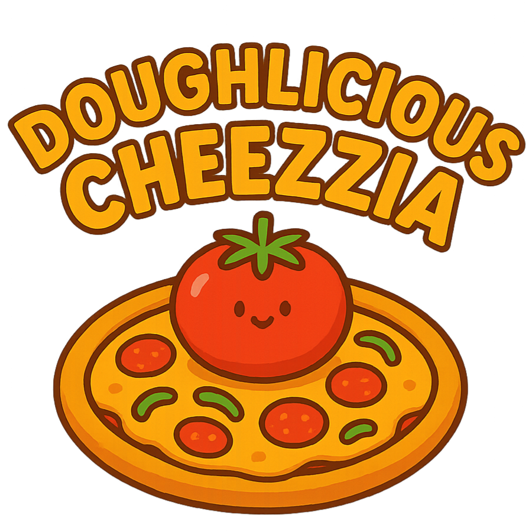
## Description of the Project

**Doughlicious Cheezzia** is a **Java console-based Point of Sale (POS) system** designed specifically for a fictional pizza shop. 
Its primary purpose is to allow staff to efficiently **create, customize, and finalize customer orders**. 
The application features a robust menu structure capable of handling custom pizzas with various sizes, crusts, 
and toppings (including premium and included types), as well as pre-defined signature pizzas, drinks, and side items like garlic knots. 
It aims to solve the problem of manual order tracking by automating pricing calculation, including taxes, and generating a detailed receipt file for every transaction. 
The intended users are the **customers, shop employees and managers**.
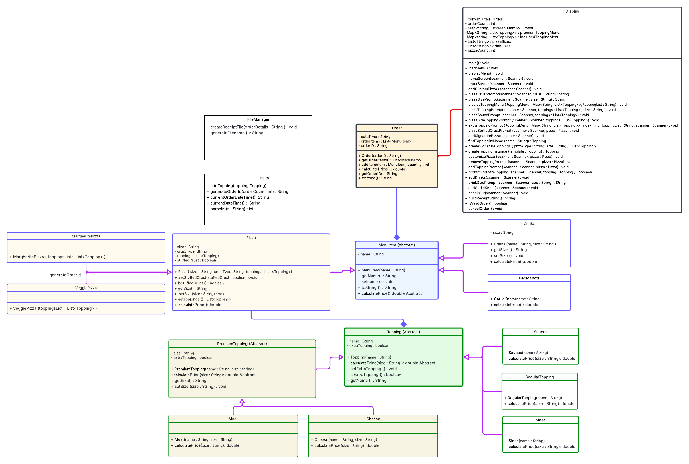

## User Stories

List the user stories that guided the development of your application. Format these stories as: "As a [type of user], I want [some goal] so that [some reason]."

- As a user, I want to have a option to build a customized pizza, so that I can order a pizza to my needs.
- As a user, I want to select from a list of premium meat toppings (e.g., pepperoni, sausage, bacon), I can add premium meats to my pizza.
- As a user, I want to be able to request 'extra' of any premium meat topping, so that I can customize the meat quantity for an additional charge.
- As a user, I want to select from a list of premium cheese toppings (e.g., Mozzarella, Ricotta, Goat Cheese), so that I can customize the cheeses on my pizza.
- As a user, I want to be able to request 'extra' of any premium cheese topping, so that I can customize the cheese quantity for an additional charge.
- As a user, I want to select from a list of regular toppings (e.g., onions, mushrooms, tomatoes), I can add standard vegetables and other items to my pizza.
- As a user, I want to be able to add stuffed crust to any pizza, so that I can upgrade the crust for a special experience.
- As a user, I want to be able to select from different sauces (e.g., marinara, pesto, BBQ), so that I can specify the base flavor of the pizza.
- As a user, I want the application to continue running until I explicitly choose the "Exit" option, so that I can process multiple orders without restarting the application.
- As a user, I want to be prompted to customize each pizza one at a time, so that I can easily focus on building one pizza completely before starting the next.
- As a user, I want to be able to add drinks and garlic knots to an order from the Order Screen, so that I can purchase non-pizza items along with my customized pizzas.
- As a user, I want to be able to cancel an order from the Order Screen, so that I can quickly start over without cluttering the system.
- As a user, I want the crust price to be automatically calculated based on pizza size (8", 12", 16"), so that The base price reflects the size I chose.
- As a user, I want to see zero charge for all regular toppings, sides, and sauces, so that I know that standard toppings are included in the base price.
- As a user, I want the price of premium meat toppings to be calculated based on pizza size and extra status, so that The price correctly reflects the premium and extra cost.
- As a user, I want the price of premium cheese toppings to be calculated based on pizza size and extra status, so that The price correctly reflects the premium and extra cost.
- As a user, I want the prices for drinks and garlic knots to be correctly included in the total, so that The price includes all non-pizza items.
- As a user, I want the Checkout screen to display the final total cost of the entire order, so that I know the exact amount due before confirming the purchase
- As a user, I want the Checkout screen to display all items and their customizations for verification, so that I can review the order details before finalizing the transaction.
- As a user, when an order is confirmed, I want the order details to be saved to a receipt file in a designated folder, so that there is a permanent record of the transaction.
- As a user, I want the receipt file to be named using the format yyyyMMdd-hhmmss.txt (date and time), so that receipts are uniquely identified and easy to sort chronologically.

## Setup

Instructions on how to set up and run the project using IntelliJ IDEA.

### Prerequisites

- IntelliJ IDEA: Ensure you have IntelliJ IDEA installed, which you can download from [here](https://www.jetbrains.com/idea/download/).
- Java SDK: Make sure Java SDK is installed and configured in IntelliJ.

### Running the Application in IntelliJ

Follow these steps to get your application running within IntelliJ IDEA:

1. Open IntelliJ IDEA.
2. Select "Open" and navigate to the directory where you cloned or downloaded the project.
3. After the project opens, wait for IntelliJ to index the files and set up the project.
4. Find the main class with the `public static void main(String[] args)` method.
5. Right-click on the file and select 'Run 'YourMainClassName.main()'' to start the application.

## Technologies Used

- Java: JDK corretto-17 Amazon Corretto 17.0.16
  Build system: Maven
- IntelliJ IDEA 2025.2.1 (Community Edition)
- **Core Java Collections:** Used `HashMap` for menu organization (`premiumToppingMenu`, `includedToppingMenu`) and `ArrayList` for storing order items and size options.
- **Object-Oriented Programming (OOP):** Utilizes inheritance (`Pizza` extending `MenuItem`, signature pizzas extending `Pizza`) and polymorphism (`calculatePrice()` overridden across various classes) to model the menu structure.

## Demo

Include screenshots or GIFs that show your application in action. Use tools like [Giphy Capture](https://giphy.com/apps/giphycapture) to record a GIF of your application.

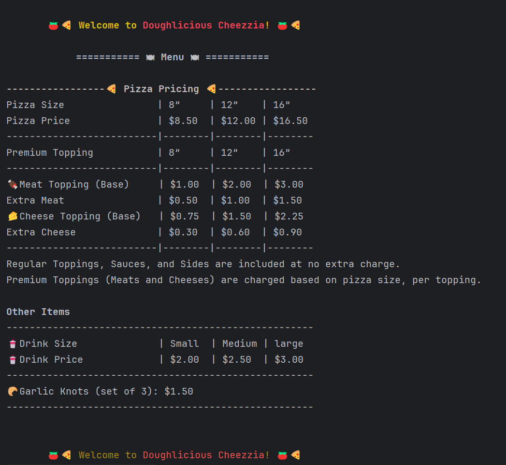
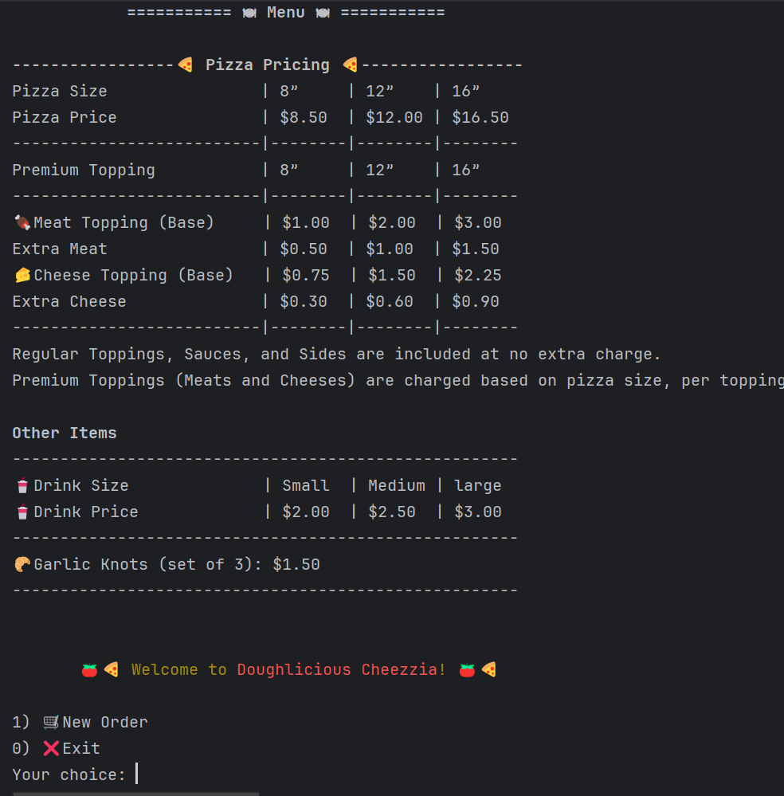
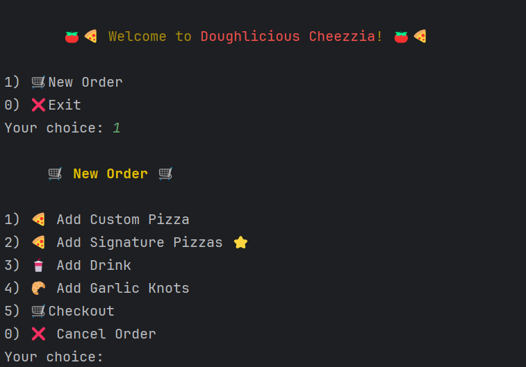
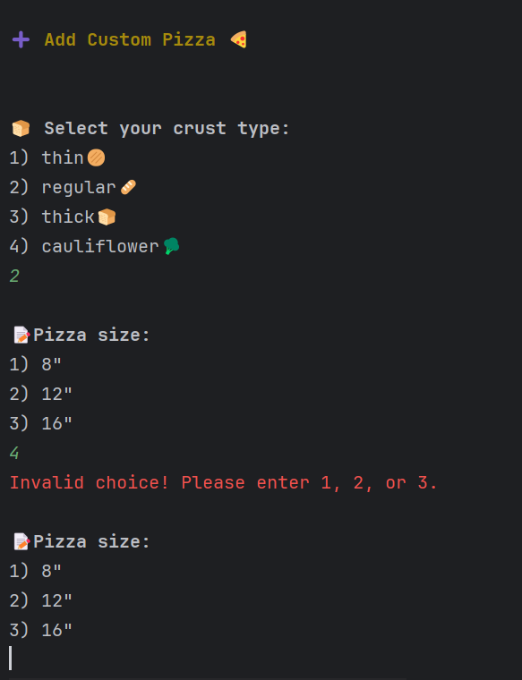
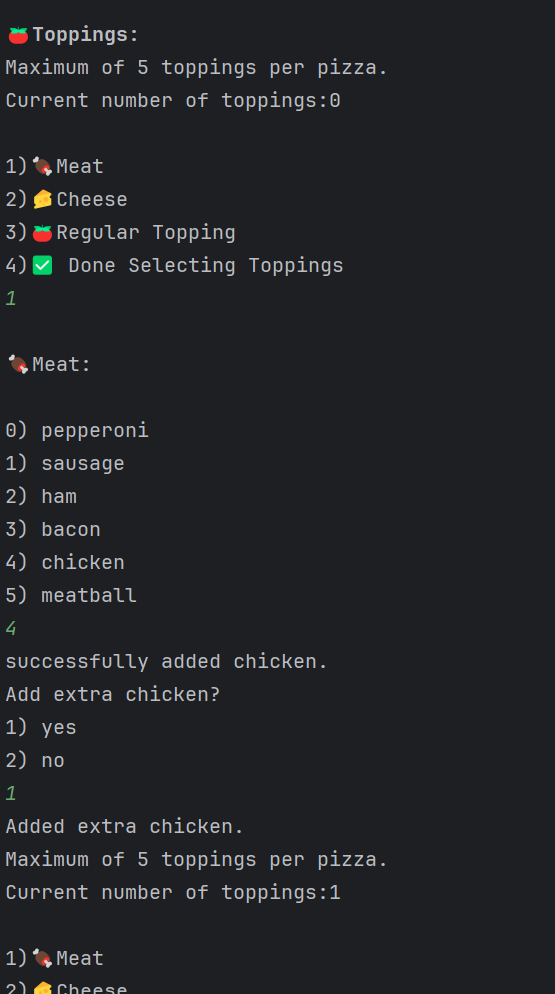
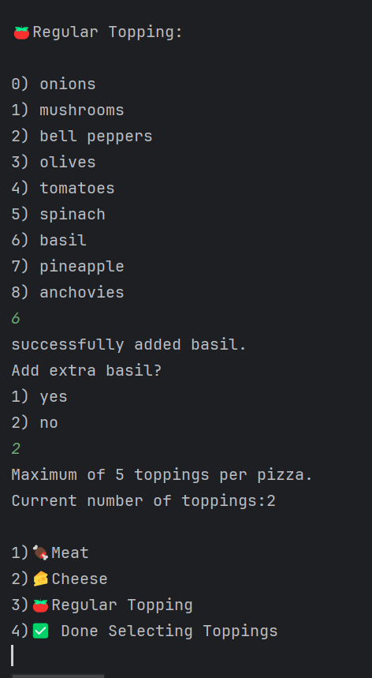
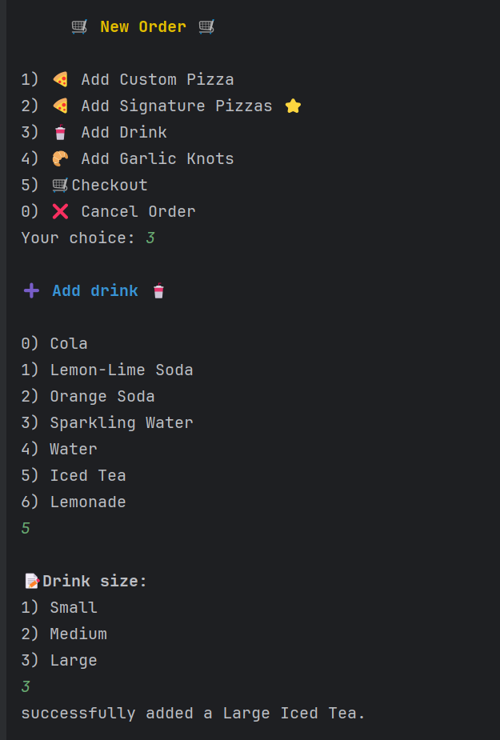
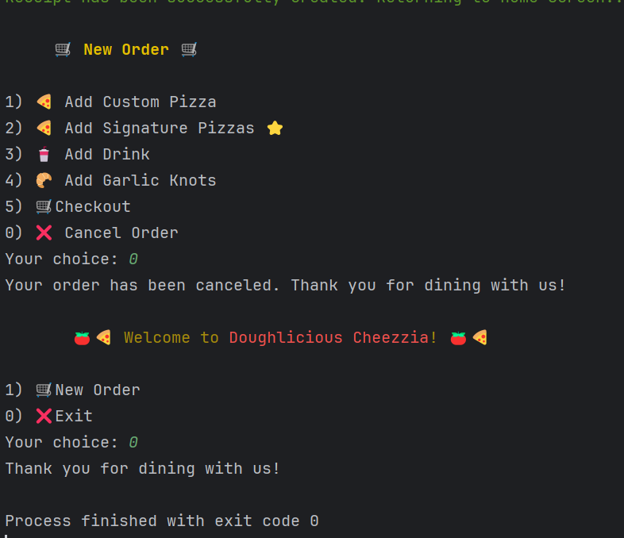
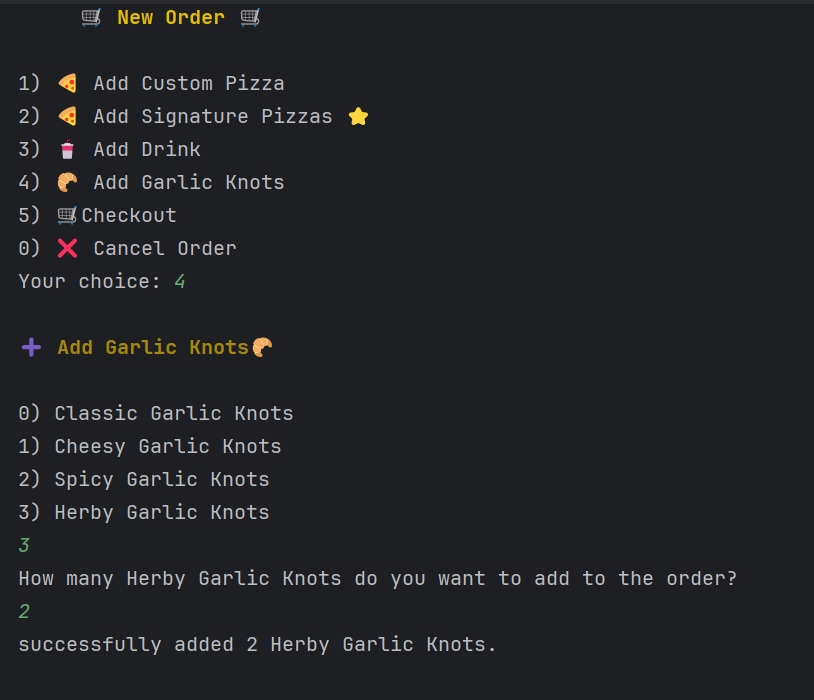

## Future Work

Outline potential future enhancements or functionalities you might consider adding:

- GUI
- Add Test
- Admin page with password
- refactoring 

## Resources

List resources such as tutorials, articles, or documentation that helped you during the project.

- The Unicode Consortium: The official source for Unicode standards was referenced for character implementation.
Source: https://www.unicode.org/consortium/consort.html
Standard: The Unicode Standard, Version 17.0

- Lucidchart: Used to design Class Diagram, illustrating the relationships between classes.

AI Tools Used for Project Assets:
- [potato-sensei](https://chatgpt.com/g/g-681d378b0c90819197b16e49abe384ec-potato-sensei)
- ChatGPT,"Used for generating LOGO image, and suggesting relevant icons and emojis for implementation."
- Gemini,Used specifically for listing and validating Unicode characters (emojis/icons) for seamless integration into the console display.

## Team Members
Qi Qing Lin

## Thanks

Express gratitude towards those who provided help, guidance, or resources:

- Thank you to Raymon Maroun for continuous support and guidance.
- A special thanks to all peers for their help along the way.
